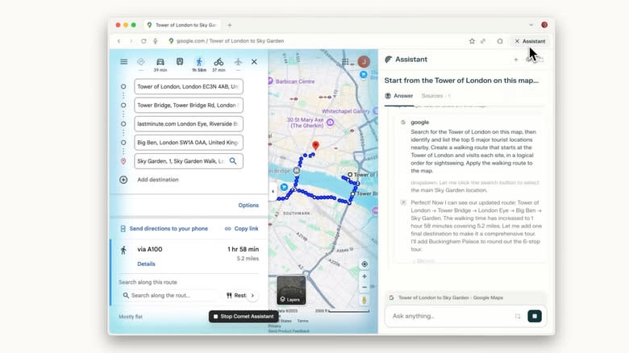

# Perplexity的Comet AI浏览器全面开放下载，但你真的需要它吗?

当AI浏览器成为科技公司的新战场，Perplexity推出的Comet终于向所有人敞开大门。这款号称"为好奇心而生"的浏览器真的值得你放弃Chrome或Edge吗?在AI助手无处不在的今天，我们需要冷静思考：更智能的浏览体验背后，你可能付出的代价是什么。

---

## 从内测到全面开放，Comet经历了什么

去年7月Comet首次亮相时，很多人对它持观望态度。但几个月过去了，Perplexity一直在打磨这款产品。他们甚至和PayPal、Venmo合作，让用户可以跳过等待名单，免费获得Pro订阅权限。

现在，Perplexity正式宣布Comet向全球用户开放，完全免费。公司在[官方博客](https://pplx.ai/ixkwood69619635)中宣称："有了Comet，互联网会变得更好。"任何想尝试内置AI助手的浏览器的人，都可以直接从官网下载。

更有意思的是，Perplexity承诺不会对浏览器或其核心功能收费。不过他们会推出Comet Plus付费版，提供"全球最权威新闻源"的访问权限——听起来像是要做一个类似Apple News+的新闻聚合订阅服务。

但免费就意味着值得下载吗?这个问题没那么简单。

## "好奇心驱动"的浏览器到底是什么样

Comet的核心卖点是为"更好奇的互联网用户"打造。Perplexity相信"好奇的人引领世界"，而Comet就是为这群人准备的工具。

默认情况下，浏览器使用[Perplexity的AI助手](https://pplx.ai/ixkwood69619635)作为搜索引擎。当然，你也可以随时切换到Google、Bing或其他选项。但很明显，Perplexity的目标是把尽可能多的用户拉进自己的生态系统。

听起来不错?先别急着下载。

## 隐私问题：AI浏览器的致命软肋

一个围绕AI构建的浏览器确实很诱人，但有一个重大问题需要警惕：**隐私**。

当你和ChatGPT或Gemini聊天时，至少你能控制分享什么信息。但在Comet这样的AI浏览器里，AI就在页面上和你一起。

这意味着什么?你访问的每个页面都可能被AI访问。从YouTube首页到你的网银账户，所有内容都暴露在AI的"视野"里。更关键的是，Comet的设计目标就是**学习你的思维方式**——这是Perplexity在推出Comet时明确表达的愿景。

Perplexity的CEO从不掩饰这一点：他在今年4月就公开表示，希望Comet能了解你的一切。这种坦率倒是挺难得，但也让人不得不多想一层。

## AI浏览器大战已经打响

Comet绝不是唯一的AI浏览器。Google最近把Gemini嵌入了Chrome，微软继续在Edge和所有服务中深度整合Copilot。Opera也刚刚发布了自己的AI浏览器Neon，同样需要排队等候。

我们正式进入了互联网的新时代。AI不会消失，而且在特朗普政府的AI行动计划推动下，这股浪潮只会越来越猛。

现在真正的问题是：你想拥抱AI浏览，还是坚守一个不那么"聪明"但也不那么"多管闲事"的浏览器?

## 免费的代价：你才是真正的产品

做决定时，请把隐私放在首位。Comet可能是免费的，但有句老话说得好：**如果你不是在为产品付费，那你就是产品本身**。

这句话从未像现在这样真实。像Comet这样的浏览器收集你的数据，然后喂给AI。你的浏览习惯、搜索记录、访问的网站——所有这些都成为训练AI的素材。

[Perplexity的AI技术](https://pplx.ai/ixkwood69619635)确实强大，但在下载之前，问问自己：为了一个更智能的搜索体验，你愿意交出多少隐私?

---

## 结语

Comet代表了浏览器发展的新方向——AI深度融合、个性化学习、即时问答。但在追求便利的同时，我们不能忽视隐私成本。如果你是重度搜索用户，对AI助手有强烈需求，Comet值得一试。但如果你更在意数据安全，传统浏览器可能仍是更稳妥的选择。想了解更多关于[Perplexity如何平衡功能与隐私](https://pplx.ai/ixkwood69619635)的信息，建议先深入研究再做决定。毕竟，选择浏览器就是选择你在互联网上的生活方式。
